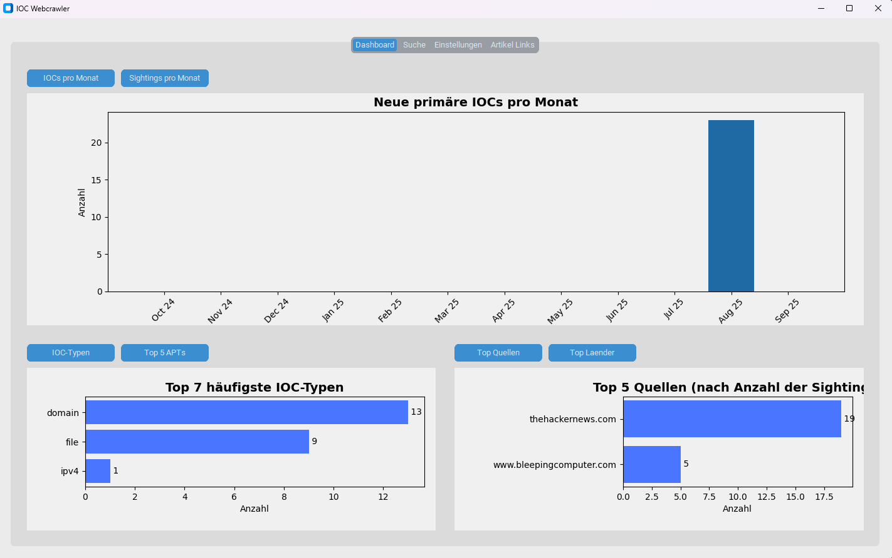

# IOC Webcrawler

Ein Tool zur automatisierten Extraktion von **Indicators of Compromise (IOCs)** aus Online-Quellen zur Beschleunigung von Cyber Threat Intelligence (CTI) Workflows.



---

## Über das Projekt

Im Bereich der Cyber Threat Intelligence ist die manuelle Sammlung von Bedrohungsinformationen einer der größten Engpässe. Sicherheitsanalysten verbringen Stunden damit, Fachartikel und Blogs zu durchsuchen, um relevante Indicators of Compromise (IP-Adressen, Domains, Hashes etc.) zu finden. Dieser Prozess ist nicht nur **zeitintensiv und repetitiv**, sondern auch **fehleranfällig und unvollständig**.

Dieses Projekt wurde entwickelt, um diesen Prozess vollständig zu **automatisieren**. Der IOC Webcrawler ermöglicht es Analysten, sich auf ihre Kernkompetenz zu konzentrieren - die Analyse und Interpretation von Daten -, anstatt ihre Zeit mit der manuellen Datensammlung zu verbringen.

---

## Features

* **Konfigurierbare Datenquellen:** Verwalte eine Liste von Nachrichten-Websites und Blogs direkt über die GUI.
* **Blacklist-Filter:** Schließe irrelevante Artikel automatisch aus, indem du eine Blacklist mit Schlüsselwörtern pflegst.
* **Automatisierte & Manuelle Scans:** Starte den Crawler per Knopfdruck oder plane regelmäßige, automatisierte Läufe (Windows & Linux).
* **Interaktives Dashboard:** Visualisiere aggregierte Daten und Trends, z. B. IOCs pro Monat, Top-Quellen und Korrelationen mit APT-Gruppen.
* **Leistungsstarke Suche & Analyse:** Durchsuche die gesamte IOC-Datenbank, filtere nach Typ/Wert und analysiere den Fundkontext in einer Detailansicht.
* **False-Positive-Management:** Markiere Fehlfunde, um sie aus der Datenbank zu entfernen und für zukünftige Scans auf eine Whitelist zu setzen.
* **Standardisierter Export:** Exportiere die gesammelten Daten in gängige Formate wie **JSON**, **CSV** und den CTI-Standard **STIX 2.1**.
* **Plattformunabhängig:** Läuft unter Windows und gängigen Linux-Distributionen (getestet mit Kali & Ubuntu).

---

## Tech Stack

* **Backend:** Python 3
* **Datenbank:** SQLite mit SQLAlchemy (ORM)
* **GUI:** CustomTkinter
* **Parallelisierung:** `concurrent.futures` (`ThreadPoolExecutor`)
* **Automatisierung:** Interaktion mit Windows Task Scheduler (`schtasks.exe`) & Linux Cron (`crontab`)

---

## Getting Started

Um eine lauffähige Kopie des Projekts zu erhalten, folge diesen Schritten.

### Voraussetzungen

* Python 3.8 oder höher
* `git` zum Klonen des Repositories

### Installation

Für eine einfache und saubere Installation wurden plattformspezifische Setup-Skripte erstellt.

#### **Windows**

1.  **Repository klonen:**
    ```bash
    git clone [https://github.com/dein-username/dein-repo.git](https://github.com/dein-username/dein-repo.git)
    cd dein-repo
    ```
2.  **Setup als Administrator ausführen:**
    * Mache einen Rechtsklick auf die Datei `setup_windows.bat` und wähle **"Als Administrator ausführen"**.
    * Das Skript richtet eine virtuelle Umgebung ein, installiert alle Pakete und legt eine Verknüpfung auf dem Desktop ab.
3.  **Verknüpfung für Admin-Rechte konfigurieren:**
    * Mache einen Rechtsklick auf die neue "IOC Crawler"-Verknüpfung → **Eigenschaften** → Tab "Verknüpfung" → **Erweitert...** → Haken bei **"Als Administrator ausführen"** setzen. Dies ist für die Planung von Tasks notwendig.

#### **Linux (Kali)**

1.  **Repository klonen:**
    ```bash
    git clone [https://github.com/dein-username/dein-repo.git](https://github.com/dein-username/dein-repo.git)
    cd dein-repo
    ```
2.  **Setup-Skript ausführen:**
    ```bash
    # Skript ausführbar machen
    chmod +x setup_linux.sh

    # Setup ausführen
    ./setup_linux.sh
    ```
    * Das Skript wird dich ggf. nach deinem `sudo`-Passwort fragen, um `python3-venv` und `python3-tk` zu installieren.
3.  **Verknüpfung vertrauen:**
    * Nach der Installation musst du eventuell auf die neue Desktop-Verknüpfung rechtsklicken und **"Starten erlauben"** (o.ä.) auswählen.


---

## Kontakt

Gino Kettler - [linkedin.profil](https://www.linkedin.com/in/gino-k-3117b0317/)
